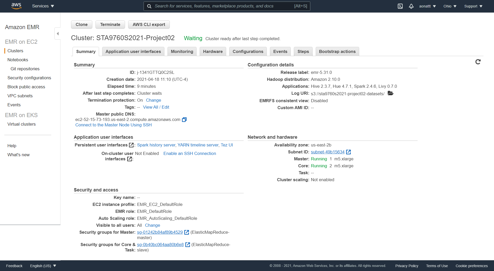

# Analyzing of Yelp Dataset

This project is to run analysis on Yelp’s dataset encompassing Yelp's businesses, reviews, and user data across 8 metropolitan areas in the USA and Canada. The size of the dataset is about 10 GB. It can be downloaded from [Kaggle](https://www.kaggle.com/yelp-dataset/yelp-dataset#yelp_academic_dataset_user.json).

## Technologies Used

To conduct this project; 

*1.Create and configure a Spark Cluster on AWS EMR.*
*2.Create and configure a Notebook in the Spark Cluster.*
*3.Load the dataset into a S3 bucket.*
*4.Run Analysis on the dataset via Jupyter Notebook*

## Cluster and Notebook Configurations

## Analysis
  Part I: Installation and Initial Setup   
  *- Install and import the necessary dependencies for the analysis.*

  Part II: Analyzing Categories  
  *- Use business dataset*
  *- Run some analysis to explore the dataset*
  *- Run some analysis to figure out most popular business categories.*

  Part III:  Do Yelp Reviews Skew Negative? 
  *- Use review dataset*
  *- Run some analysis to explore the dataset*
  *- Unveil an answer to the question: Do Yelp Reviews Skew Negative?*
    
  Part IV: Should the Elite be Trusted? 
  *- Use user dataset*
  *- Run some analysis to explore the dataset*
  *- Unveil an answer to the question: Should the Elite be Trusted?*
  *- Find which states have most reviewers*

